# 🥚 달걀 마켓

백엔드 알팀 당근마켓 클론코딩 프로젝트

---

## 🧑‍🤝‍🧑 팀원 소개

| Scrum Master  | Product Owner| Developer | Developer | Mentor |
|------------|-----------|-----------|------|------|
| 김용철       | 최인창     | 마지영     | 이연우    | 알 |

## 프로젝트 목표

- 당근마켓, 중고나라와 같은 중고거래 시스템을 만드는 것을 목표로 진행했습니다.
- 구현 뿐만 아니라 클라우드 환경에서 애플리케이션을 CI/CD를 통해 배포하는 경험을 하는 것을 목표로 진행했습니다.

### 애플리케이션 흐름
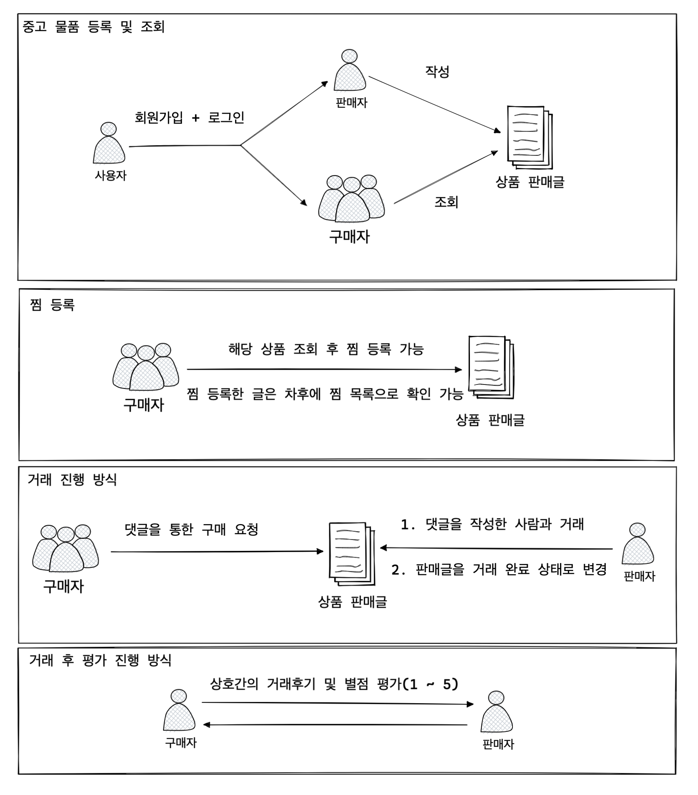

## 개발 언어 및 활용기술

### 백엔드 
| 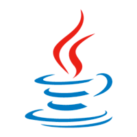 |  | 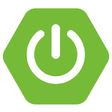 | 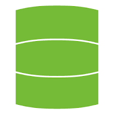 |   |
|----------------------------|------------------------------|------------------------------------------|--------------------------|-------------------------------|
| Java 17                    | maven                        | Spring Boot                              | Spring Data JPA          | Spring Security               |

| 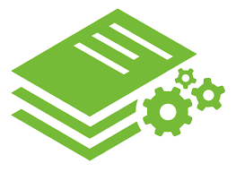 | 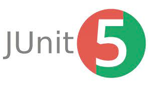 |  | 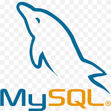 |
|------------------------------------|------------------------------|----------------------------------|------------------------------|
| Spring RestDocs                    | Junit 5                      | Mockito                          | MySQL 8                      |
### DevOps
|  |  | 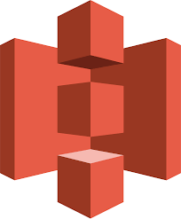 | 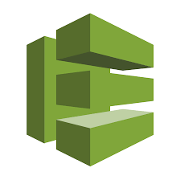 |  |
|--------------------------------------|------------------------------|----------------------------|--------------------------------------------|------------------------------|
| Github Actions                       | AWS EC2                      | AWS S3                     | AWS CodeDeploy                             | AWS RDS                      |

### 협업툴
|  |  |  | 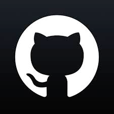 |
|------------------------------|----------------------------------|--------------------------------|----------------------------------|
| JIRA                         | notion                           | Slack                          | Github                           |

## 브랜치 관리 전략
브랜치 관리 전략은 github flow를 사용합니다.

모든 브랜치는 Pull Request를 통해 팀원의 리뷰 후 메인에 merge 할 수 있습니다.

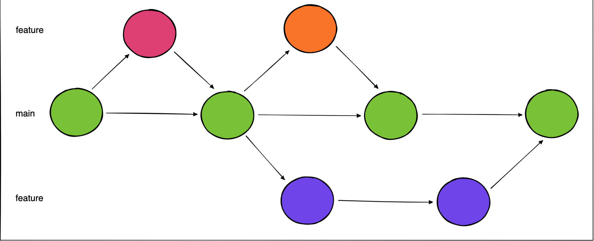
- main : feature 브랜치에서 개발이 완료되었을 때 main으로 merge 되며 바로 배포할 수 있는 상태여야 합니다.
- feature : 기능 개발을 진행할 때 사용합니다.
## 설계

### ERD
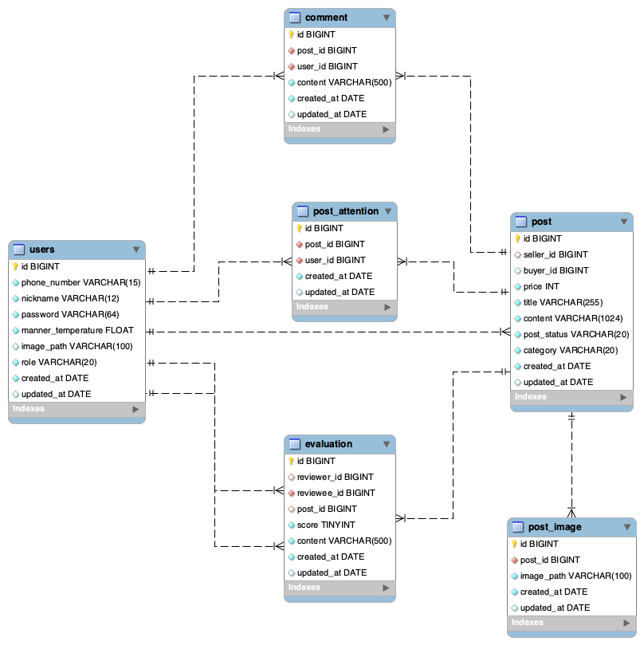

### 인프라 구조
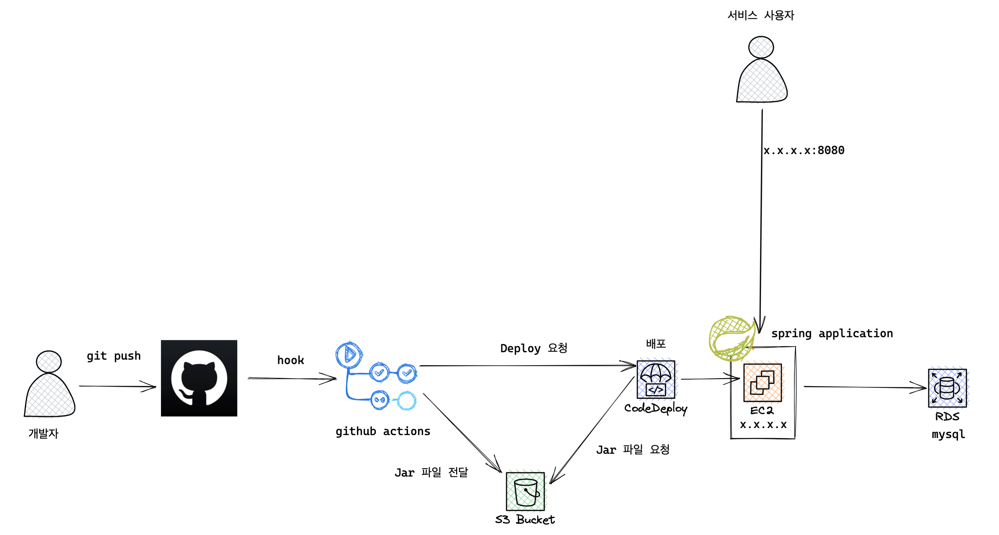

### API 문서
[달걀마켓 API 문서 확인](http://13.124.250.199:8080/docs/index.html)

## 실행 방법

``` shell
    git clone https://github.com/prgrms-be-devcourse/BEDV2_Egg-market.git
    cd BEDV2_Egg-market
    mvn package
    java -jar ./target/eggmarket-0.0.1-SNAPSHOT.jar
```

## 프로젝트 페이지
[프로젝트 문서](https://www.notion.so/backend-devcourse/2-b71b5638caac4234943614a8cc103806)

### 회고
[프로젝트 회고](https://www.notion.so/backend-devcourse/36798548e8ac4eac914405e4be30c33a)